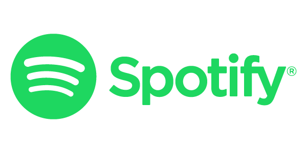

### - Spotify Automated Music Player

Application responsible for getting the chosen user music and playing it on user's spotfiy account. You just have to provide your spotify username/email, password and the chosen music.
___

### - Getting Started

- Clone Project
- Install dependencies
- Provide the env file with the required envs
- Start the software by running: `npm start`
- Runs on command line
- A headless chrome are going to be opened up and your music will start to play

**Obs: DO NOT FORGET TO PROVIDE ENV VARIABLES!**
___

